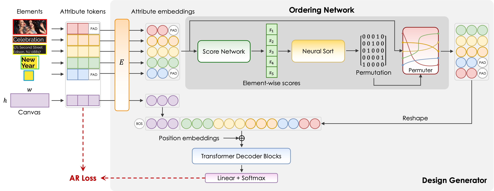

<div align="center">
<h1>Order Matters: Learning Element Ordering for <br> Graphic Design Generation (TOG 2025)</h1>

[Bo Yang](https://borisyang326.github.io/), [Ying Cao†](https://www.ying-cao.com/)

<sup>†</sup>Corresponding Author

ShanghaiTech University

<a href='https://dl.acm.org/doi/10.1145/3730858'></a>
<a href='https://borisyang326.github.io/ordermatters.html'></a>
<a href='https://github.com/borisyang326/OrderGOL'></a>
[](https://github.com/borisyang326/OrderGOL)

</div>

<p align="center">
  
</p>

## 🏷️ Change Log 

- [2025/08/05] 🔥 We release the source code and checkpoints.
- [2025/04/30] 🔥 We release the <a href='https://borisyang326.github.io/ordermatters.html'>project page</a>.
- [2025/04/27] 📄 Paper accepted to ACM Transactions on Graphics (SIGGRAPH 2025).

## 🔆 Method Overview

<p align="center">
  
</p>

We propose a **G**enerative **O**rder **L**earner (GOL) that learns optimal element ordering strategies for graphic design generation. Our approach consists of:

- **Design Generator**: A Transformer-based autoregressive model that generates design sequences
- **Ordering Network**: A neural network that learns content-adaptive element ordering
- **Joint Training**: Both networks are trained simultaneously for mutual improvement

The key insight is that the order in which design elements are generated significantly impacts the quality of the final design. Our neural order outperforms random and raster ordering strategies.

## ⚙️ Setup

### Environment Setup
```bash
conda env create -f requirements.yml
conda activate ordergol   
pip install torch==2.1.1 torchvision==0.16.1 torchaudio==2.1.1 --index-url https://download.pytorch.org/whl/cu121
pip install -r requirements.txt
```

### Dataset Setup
1. **Download the Crello Dataset**
   
   Download [crello.zip](https://drive.google.com/file/d/1YZ2gjCC0QMPdr18oYEe8mv_w5RO_eYDX/view?usp=sharing) from the provided link and place it in your project directory.

2. **Extract Dataset**
   ```bash
   unzip crello.zip
   mv crello data/
   ```
   
   The dataset should be organized as:
   ```
   data/
   └── crello/
       ├── cache/          # Preprocessed .pt files (auto-generated)
       ├── weights/        # Clustering information for preprocessing
       └── ...            # Other dataset files
   ```

**Note**: The `CrelloDataset` class will prioritize loading preprocessed `.pt` files from `data/cache/`. If these files are not found, it will automatically preprocess the data based on pre-computed clustering information in `data/weights/`.

## 🚀 Training

For detailed training instructions, see [TRAIN.md](TRAIN.md).

## 🎯 Evaluation

For detailed evaluation instructions, see [EVAL.md](EVAL.md).


## 📁 Project Structure

```
OrderGOL/
├── configs/               # YAML Configuration files
├── data/                  # Dataset directory
├── ckpt/                  # Model checkpoints
├── src/                   # Source code
│   ├── model/             # Design Generator implementations
│   │   ├── design_transformer.py
│   │   ├── layout_transformer.py
│   │   ├── codebook.py
│   │   └── ...
│   ├── scorer.py          # Ordering Network (main component)
│   ├── sort.py            # Neural sorting algorithms
│   ├── dataset/           # Data load, preprocess and rendering
│   │   ├── crello_dataset.py
│   │   ├── helpers/
│   │   └── ...  
│   ├── fid/               # FID computation (seq/visual embedding space)
│   │   ├── seq/           # Sequential embeddings
│   │   └── visual/        # Visual embeddings
│   ├── configs.py         # Experiment configurations (non-YAML args)
│   ├── trainer.py         # Training pipeline
│   ├── sampling.py        # Sampling strategies
│   ├── metric.py          # Evaluation metrics
│   ├── preprocess.py      # Data preprocessing utilities
│   ├── saliency/          # Saliency-related utilities
│   └── utils.py           # Helper functions
├── train.sh               # Training script
├── eval.sh                # Evaluation script  
├── main.py                # Entry point
├── assets/                # Repo figures
├── requirements.txt/yml   # Python dependencies
└── README.md              # This file
```

## ❤️ Acknowledgments

This project is built upon several excellent open-source projects:
- [LayoutDM](https://github.com/CyberAgentAILab/layout-dm): main hydra-based training pipe, diffusion-based design generator.
- [LayoutTransformer](https://github.com/kampta/DeepLayout): dataset utilities, auto-regressive design generator.

We thank the authors of these projects for their contributions to the open-source community.

## 📭 Contact

If your have any comments or questions, feel free to contact [borisyang326@gmail.com](mailto:borisyang326@gmail.com)

## 🎓 Citation

If our work helps your research or applications, please consider citing our paper:

```bibtex
@article{yang2025order,
  author = {Yang, Bo and Cao, Ying},
  title = {Order Matters: Learning Element Ordering for Graphic Design Generation},
  year = {2025},
  issue_date = {August 2025},
  publisher = {Association for Computing Machinery},
  address = {New York, NY, USA},
  volume = {44},
  number = {4},
  issn = {0730-0301},
  url = {https://doi.org/10.1145/3730858},
  doi = {10.1145/3730858},
  journal = {ACM Trans. Graph.},
  articleno = {34},
  numpages = {16}
}
```

## 📄 License

This project is licensed under the MIT License - see the [LICENSE](LICENSE) file for details.
